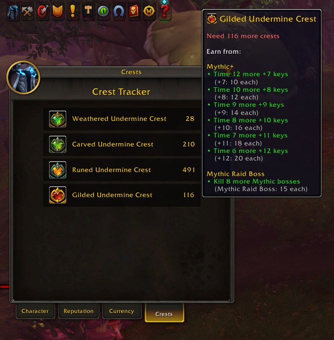

# 🏆 CrestTracker



**CrestTracker** is a World of Warcraft addon that adds a new window showing how many crests you still need to upgrade your current gear.

It tracks the four new crest types introduced in *The War Within*. Currently supporting Season 3 Crests:
- **Weathered Ethereal Crest**
- **Carved Ethereal Crest**
- **Runed Ethereal Crest**
- **Gilded Ethereal Crest**

### ✨ Features
- Scans your currently equipped gear
- Calculates how many crests you still need per gear slot
- Shows crest deficits and where you can farm more
- Hover tooltips break down crest sources (e.g. Mythic+, Raid, Timewalking)

### 🔧 Installation
1. Copy the `CrestTracker` folder into your WoW AddOns directory:
   ```
   World of Warcraft/_retail_/Interface/AddOns/
   ```
2. Restart WoW or run `/reload`
3. Open the Crest Tracker window by typing `/cresttracker` or by using the Minimap Button.
